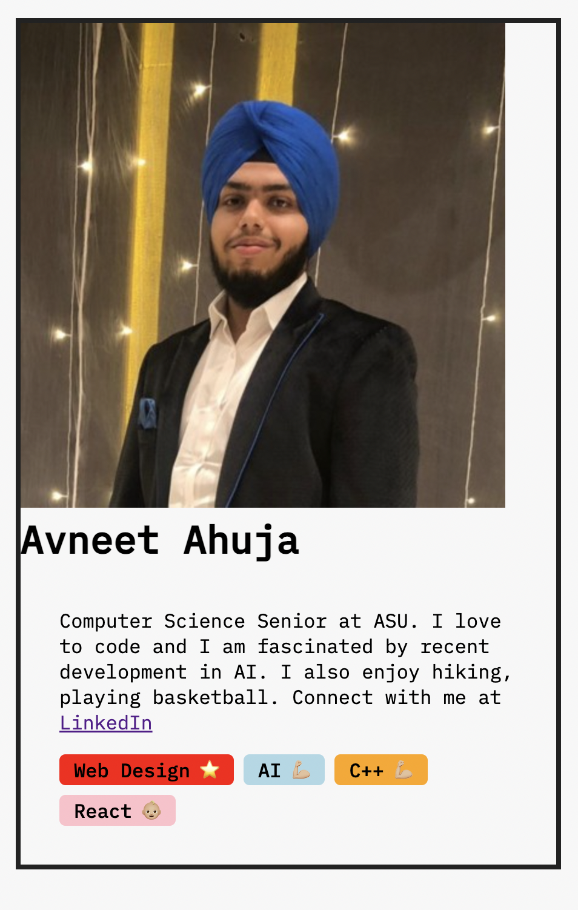
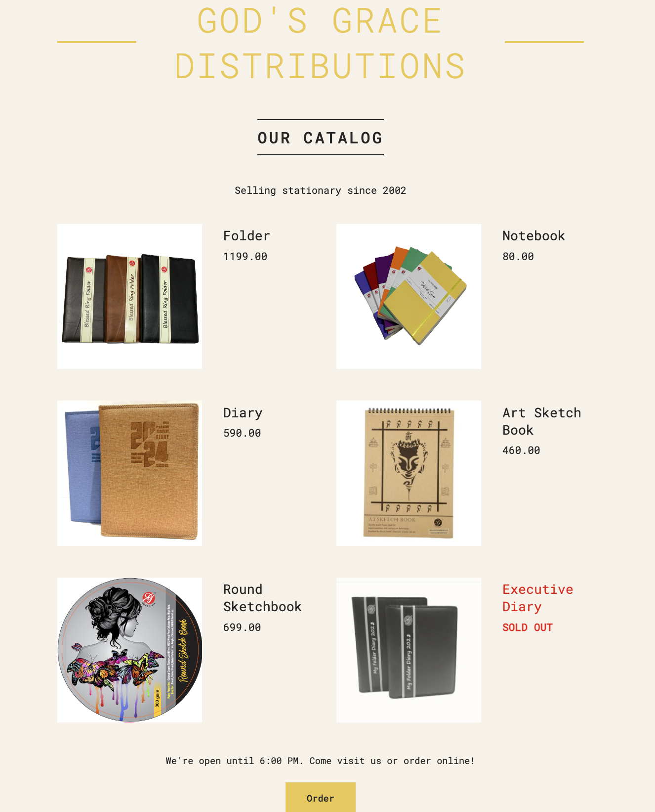

# Week 1

This is the beginning to my react journey here is what I managed to complete in this week:

## Day 1:
- Worked on my first react app following a tutorial, used api calls, props, useEffect, useState and JSX, link to sandbox is here:
[SandBox](https://codesandbox.io/p/sandbox/bitter-sound-tjrkw7?file=%2Fsrc%2Findex.js%3A30%2C36)

  And the link to the app is here:
  [App](https://tjrkw7.csb.app/)

- Wrote a pure react app, included a clock that ticks, file can be found in pure react folder

## Day 2:
- Decided to learn/review some JS concepts that may be used in React including: Destructuring arrays/objects, template literals, Array ops like map, filter, sort, optional chaining, async methods, etc.

## Day 3:
- Learned Components how to nest them and started learning JSX rules, made a profile card mini project at the following code sandbox:
  [SandBox](https://codesandbox.io/p/sandbox/profilecard-gfq7px?file=%2Fsrc%2Findex.js%3A59%2C9)

  Link to app page:
  [App](https://gfq7px.csb.app/)

  Preview: 
  

    
  

## Day 4:
- Developed a static web page for a local company, proof of concept really, going to start to learn how to make it dynamic (interactive). Anyways, in this one, used lots of components, props, conditional rendering, played around with JSX and it did hurt my head a bit at the start with JS being within JSX and having some JSX inside it but getting used to it as I progress. The page's v1 can be found under the **stationaryApp** folder. Here is a preview of the page:
   
  

    
  

## Day 5:
- Learned how to make interactive components using states in React, found out React is called React because it reacts to the change in state and re-renders the UI. All in all, states are pretty cool and easy to use! [Here](https://l689ss.csb.app/) is an interactive date counter app that I built using states, I have not styled it as I was just trying to see how well I understand it.

## Day 6:
- Tested out my knowledge of states and wanted to practice some questions from my Distributed Software Development class so made a quizlet-style flashcards React app [here](https://d3d8dd.csb.app/)

## Day 7:
- Got a trip coming up, so started making an interactive packing list app by follwing a tutorial, further learning state management including: when to use states, difference between global and local states, what are derived states, etc.
